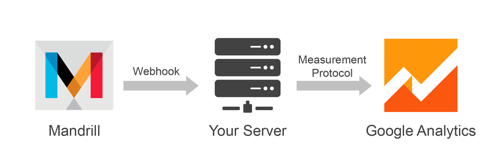

# Mandrill Integration for Google Analytics

## Overview

This integration allows you to import your e-mail event data like opens, clicks or bounces from [Mandrill](https://mandrillapp.com/) into [Google Analytics](https://www.google.com/analytics/) for a single interface dashboard and deeper e-mail performance analysis.

This integration is based on webhooks so data is ready in nearly real-time.

## Features

Supported e-mail events:
* Send
* Open
* Click
* Spam
* Hard Bounce

This integration allows you to explore your data by the following dimensions:
* E-mail type, in case your application have different e-mail types
* Device category (mobile, desktop, tablet)
* Geographic location (city, country...)
* Hostname (domain)

Universal Analytics **user_id** feature is also supported.

## Example

{{Screenshot, to be added}}

## How to set up

### 1) Install the webhook processing script in your server

First, install the webhook processing script in your server. [PHP sample code is available here](php-webhook.php), but you can use any other server side language if you prefer.

### 2) Add the webhook your Mandrill account

From your [Mandrill account](https://mandrillapp.com/), go to *Settings* > *Webhooks* > *Add a Webhook*.

Fill the form using the following settings:

Please do not forget to replace the "Post To URL" field with the actual URL your webhook processing script is located.

### 3) Create custom metrics in Google Analytics

From your [Google Analytics account](https://www.google.com/analytics/), go to *Admin* > *Custom Definitions* > *Custom Metrics*.

Then create these custom metrics:

Name           | Scope | Index | Type    | Min. Value | Max. Value | Active
---------------|-------|-------|---------|------------|------------|-------
Sent           | hit   | 1     | integer | -          | -          | Yes
Opens          | hit   | 2     | integer | -          | -          | Yes
Clicks         | hit   | 3     | integer | -          | -          | Yes
Marked as Spam | hit   | 4     | integer | -          | -          | Yes
Bounces        | hit   | 5     | integer | -          | -          | Yes

### 4) Install custom report in Google Analytics

Install [this Google Analytics custom report](https://analytics.google.com/analytics/web/template?uid=DemkGMjTR42HT6YuG483Og) into any data views in your account.

### 5) Optional: pass email_type and/or user_id to Mandrill e-mail metadata fields

In case your web application uses different e-mail types and you want to segment your data based on this dimension or you want to take advantage of the Universal Analytics user_id feature, please set your application to be pass the email_type and/or user_id metadata fields to Mandrill at the time of sending new e-mails.

## Additional Resources
* Google Analytics Measurement Protocol Parameter Reference: https://developers.google.com/analytics/devguides/collection/protocol/v1/parameters
* Mandrill API Message Event Webhook Format: https://mandrill.zendesk.com/hc/en-us/articles/205583307-Message-Event-Webhook-Format